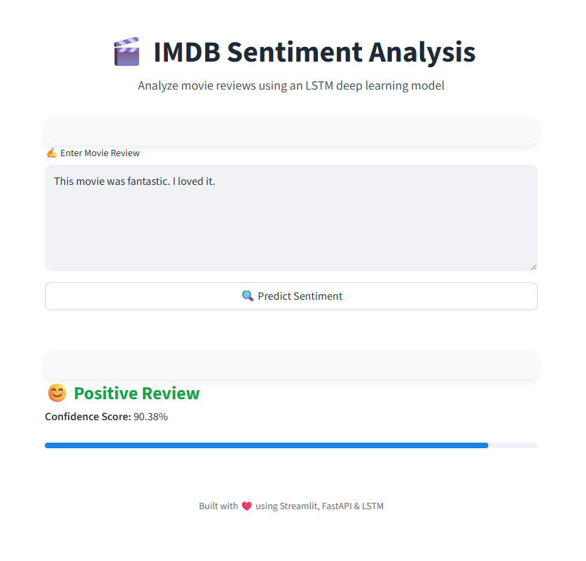
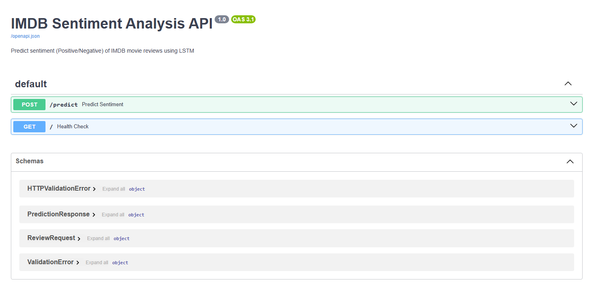

# 🎬 IMDB Movie Reviews Sentiment Analysis
**LSTM • FastAPI • Streamlit • Docker • Render**


---


## 📌 Project Overview

This project is an **end-to-end Machine Learning application** that predicts whether a movie review is **Positive** or **Negative** using a **Long Short-Term Memory (LSTM)** neural network.

The trained model is:
- Exposed via a **FastAPI REST API**
- Visualized using an **interactive Streamlit web app**
- Fully **containerized with Docker**
- **Deployed on Render**

---

## 🌐 Live Deployment (Render)

🔗 **FastAPI Swagger UI:**  
Link : https://imdb-sentiment-app-v1.onrender.com/docs

🔗 **Streamlit App:**  
Link : https://lstm-imbd-movie-sentiment-analysis.streamlit.app/


---

## 🧠 Problem Statement

Online platforms receive millions of textual reviews daily. Manually analyzing sentiment is inefficient and error-prone.  
This project automates **sentiment classification of IMDB movie reviews**, enabling scalable and real-time sentiment analysis.

---

## 📊 Dataset

- **IMDB Movie Reviews Dataset**
- 50,000 labeled reviews (`positive`, `negative`)
- Balanced binary classification problem

Dataset location:
```
IMDB_Dataset.csv
```

---

## 🤖 Model Architecture

- Embedding Layer (Vocabulary size: 5000)
- LSTM Layer (128 units)
- Sigmoid Output Layer

**Loss:** Binary Crossentropy  
**Optimizer:** Adam  
**Metric:** Accuracy  

---

## 🧪 Training the Model

```bash
python train.py
```

Artifacts generated:
- `model.h5`
- `tokenizer.pkl`

---

## 🚀 FastAPI Inference Service (Local)


```bash
uvicorn predict:app --host 0.0.0.0 --port 9696
```

Swagger UI:
```
http://localhost:9696/docs
```

---

## 🎨 Streamlit App (Local)

```bash
streamlit run app.py
```

```
http://localhost:8501
```

---

## 📸 Streamlit UI Preview


---

## 🐳 Docker Usage

### Build Image
```bash
docker build -t imdb-sentiment-app .
```

### Run Container
```bash
docker run -p 9696:9696 imdb-sentiment-app
```

---

## ☁️ Docker Hub Image


```bash
docker pull ayushgurjar10/imdb-sentiment-app:latest
docker run -p 9696:9696 ayushgurjar10/imdb-sentiment-app:latest
```

---

## 📁 Project Structure

```
imdb-sentiment-lstm/
│── uv.lock
│── pyproject.toml
│── notebook.ipynb
│── train.py
│── predict.py
│── app.py
│── model.h5
│── tokenizer.pkl
│── requirements.txt
│── Dockerfile
│── README.md
│── test0.py
│── test1.py
│── README.md

```

---

## ✅ ML Zoomcamp Evaluation Coverage

- Problem description ✅
- EDA ✅
- Model training ✅
- Notebook → script ✅
- Reproducibility ✅
- API deployment ✅
- Docker containerization ✅
- Cloud deployment (Render) ✅

---

## 🏆 Conclusion

This project demonstrates **full-stack ML engineering**, covering data preprocessing, deep learning, API development, UI visualization, containerization, and cloud deployment.


